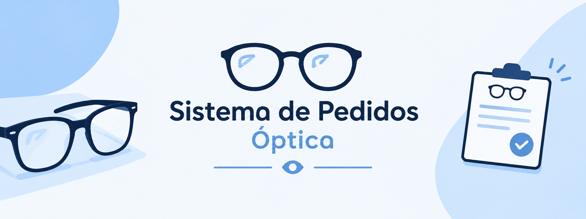

# Sistema-de-Pedidos-Optica
Proyecto de clases de Ingeniería de Software II para aprender sobre calidad y explorar más sobre el desarrollo de software siguiendo las normativas y estándares.

Este proyecto esta sujeto a cambios y no esta pensado en ser implementado de forma completa por lo que esta sujeta a varias limitaciones de desarrollo.
